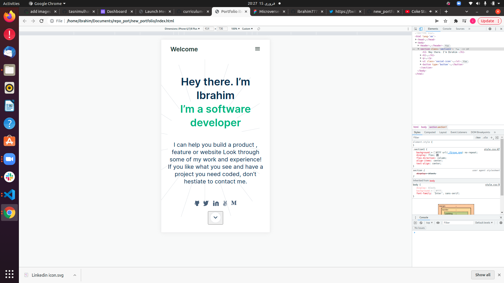

# new_portfolio# dyfirst

# Project Name
Portfolio: setup and mobile version skeleton

> Description the project.
For the first milestone in the process of creating your portfolio website, you will:

set up a new repository and prepare it for development using best practices (e.g. linters).
build the first 2 sections of the mobile website using the template you chose in the previous step

## Built With

- Html
- Css

## Getting Started

To get a local copy up and running follow these simple example steps.

## Authors

👤 **Author1**

- GitHub: https://github.com/ibrahim777764

## 🤝 Contributing

Contributions, issues, and feature requests are welcome!

## Show your support

Give a ⭐️ if you like this project!

## Acknowledgments

- Hat tip to anyone whose code was used
- Inspiration
- etc

## 📝 License

This project is [MIT](./MIT.MD) licensed.
